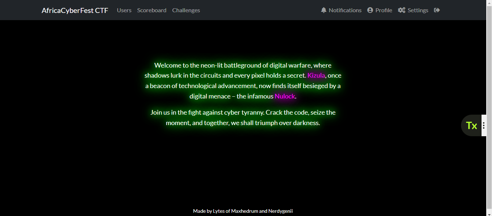
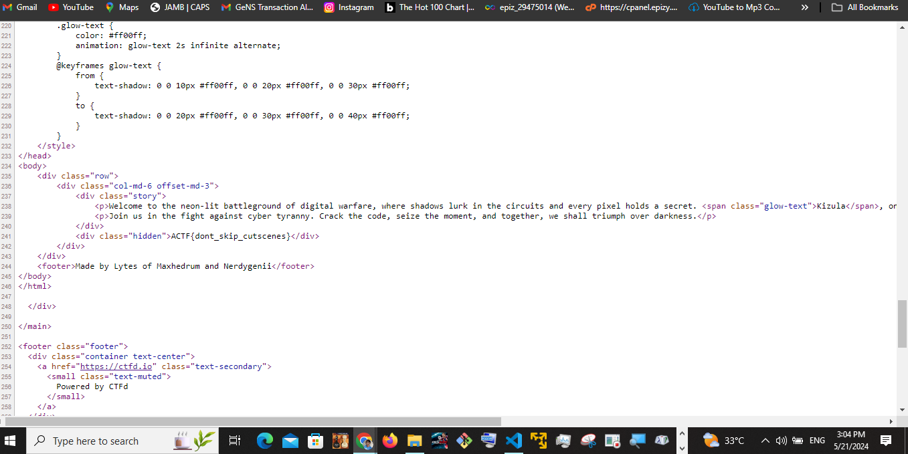
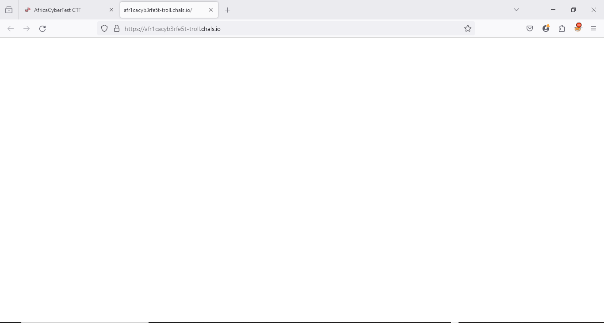
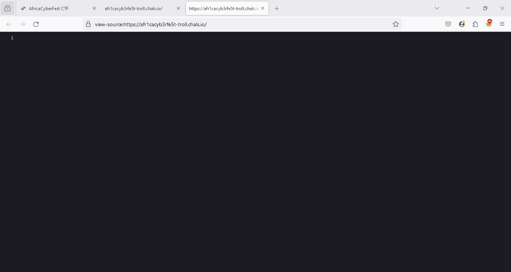
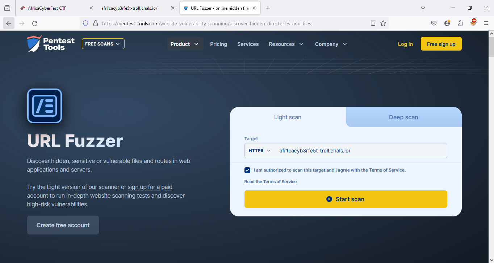
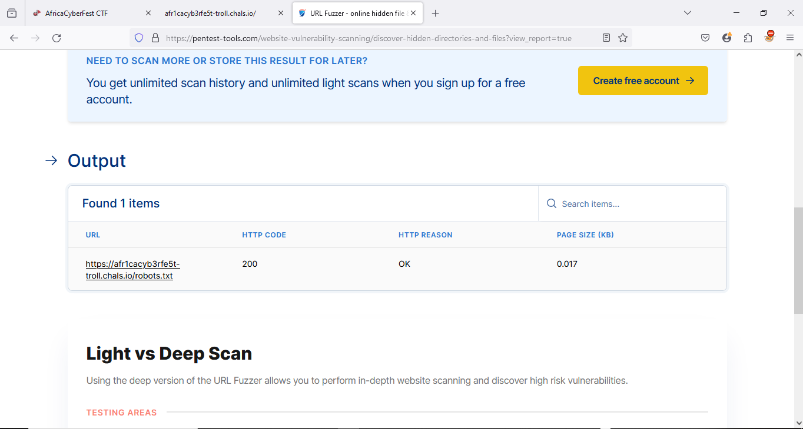
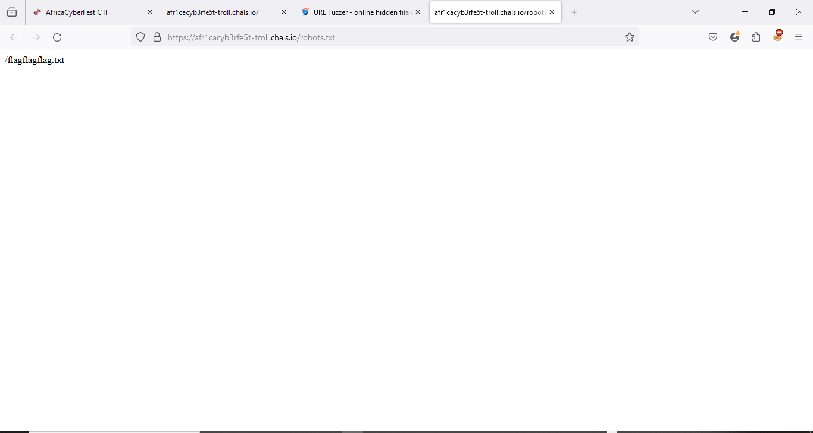
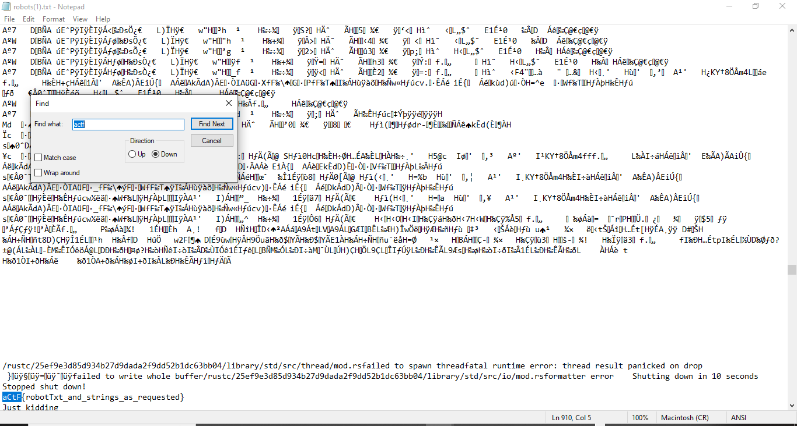

# AfricaCyberfest CTF 2024 



Hi 👋,

I had the pleasure of participating in the AfricaCyberFest 2024 CTF with my team, BOTscope, under the alias Lan0srespii_Legacies. In this repository, I'll be sharing detailed write-ups for some of the challenges I managed to solve during the competition.

<h3>Challenges</h3>

## General
- Do you read
- Say Hello
- Do you read 2
  
## Cryptography
- ByteOps

## Web
- Troll

## Reverse Engineering
- Sore
- Finding Nulock

## Digital Forensics
-  Whispers in the Wires
  
## Misc
-  Hip Hip HIp!


Let try to solve this 😎


### Do you read


It's clearly referring to the main page of the site, so I navigated there, inspected the page source, and found the flag.


```
Flag: ACTF{dont_skip_cutscenes}
```

### Say Hello


Since I had been following most of the accounts already, I followed the new ones and then submitted. `Yes` :)

```
Flag: Yes
```

### Do you read 2


Just submit that 

```
Flag: actf{i_did_not_skip_this_cutscene}
```


### Troll


-- He delivered


Now let's get to it

Going to the attached url doesn't show anything


Viewing page source reveals nothing also



To ensure the security and thorough assessment of the target website, I utilized the "Discover Hidden Directories and Files" tool provided by Pentest-Tools.com. This tool is designed to uncover directories and pages that are not easily visible through standard navigation or indexing.




After searching for hidden directories, I found this site, 


After navigating to the robots.txt page, I found that the content included the line "/flagflagflag.txt," indicating that a flag might be related to this file. Additionally, I downloaded the robots.txt file for further analysis.


I opened the robots.txt file with Notepad and found a word matching the pattern "actf
Boom! I found the flag. 


```
Flag: aCtF{robotTxt_and_strings_as_requested}
```


### Finding nulock 


This was the first reverse engineering challenge, and we were given an apk file


First thing I tried was to unzip the file, grep for the flag, convert the dex files to jar using `dex2jar`, decompile the converted dex file using `jd-gui`

Doing that I didn't really get anything and `jd-gui` decompilation was a bit off

So I tried using an online [decompiler](https://www.decompiler.com/)


Next i downloaded the zip file


Unzipping it and opening in vscode should give this


Looking through the classes i saw `Payload.java` which looked interesting

Viewing it shows this


We can right away tell we should decode that

I just copied and paste that array to python interpreter then converted them to `chr`


That gives error and that's because it isn't in the printable range for example `-5` isn't a printable value

To fix this we need to `AND` it with `255 == 0xff` which is equivalent to `% 256` and that would make each value there in the printable range


With that we get the flag

```
Flag: ACTF{Dynamic_Analysis_h0s7_R3v3al5}
```

### Sore


The second and last reverse engineering challenge

We are given an executable file


The description states that it's a malware yet silly me still ran it 💀

When I ran it, the program asks for input


After we give it input then it would log out from the current session

That's why i am running it in gdb so that it won't logout yet

One important thing is this:

```
Input the flag. I'll let you know if it's correct
```

The program claims it will let us know if our provided input is right? That means it's going to be giving us an oracle which would basically allow us know if each character of the given input is right or wrong therefore giving us the primitive to brute force the flag

But before we think of brute forcing I needed a way to prevent it from logging out

I threw the binary into Ghidra to do some reversing or so I thought?

Unfortunately the binary is a rust compiled binary and I am not familiar with rust so I had some issue with figuring out what it does

But my goal was to figure out the instruction which would call program to logout our session and thereby patching it

Starting from the entry function I got this


The main function is the first parameter passed to `__libc_start_main` which is `FUN_0012bc90`

Clicking on it shows this


```c
void FUN_0012bc90(int param_1,undefined8 param_2)

{
  code *local_8;
  
  local_8 = FUN_0012b890;
  FUN_002eb380(&local_8,&PTR_FUN_00398048,(long)param_1,param_2,0);
  return;
}
```

Variable `local_8` is a function pointer to `FUN_0012b890` 

Clicking on that shows this, which seems to be the function that handles the input validation and presumably the logout function?


Since it's going to logout after we give it input i decided to start clicking on functions which is at the end

```c
LAB_0012baba:
    local_90 = &PTR_s_Wrong!_Input_the_flag._I'll_let_y_00398098;
    local_88 = 1;
    local_80 = 
    "Wrong!\nInput the flag. I\'ll let you know if it\'s correct\nFailed to read inputmain.rsYou\'re  partially right\n"
    ;
    local_78 = ZEXT816(0);
    FUN_002eee30(&local_90);
    local_90 = (undefined **)thunk_FUN_00167990();
    if (local_90 != (undefined **)0x0) {
      FUN_0012b750(&local_90);
    }
    goto LAB_0012bb04;
  }
  goto LAB_0012ba50;
}

```

On clicking funtion `thunk_FUN_00167990`, i saw that it's the function that handles the logout


The function names are stripped which makes assumption hard since I don't know rust but we can tell because of this:

```c
cVar6 = FUN_001671e0("org.gnome.SessionManager/org/gnome/SessionManagerorg.kde.ksmserver/KSMServer org.kde.KSMServerInterfacelogoutorg.xfce.SessionManager/org/xfce/SessionManagerorg.freedesktop.log in1/org/freedesktop/login1org.freedesktop.login1.ManagerLogout"
```

The logout string there should just make you guess you are at the right track (don't quote me) 👀

Now that we figured that we need to patch the opcode


```
        0012baea ff 15 58        CALL       qword ptr [->thunk_FUN_00167990]                 undefined thunk_FUN_00167990()
                 d3 27 00                                                                    = 0012de50
```

So we will change `0xff1558d32700` to `0x909090909090`

With that instead of the program calling that function it will just do nothing (nop -> no operation)

Here's the [script](https://github.com/h4ckyou/h4ckyou.github.io/blob/main/posts/ctf/cyberfest24/scripts/sore/patch.py) I wrote to patch it

```python
with open("sore", "rb") as f:
    binary = f.read()

f.close()

binary = binary.replace(b"\xff\x15\x58\xd3\x27\x00", b'\x90'*6)

with open("patched", "wb") as f:
    f.write(binary)
```

Running that it should patch the binary and now we can easily run it

To confirm if the program would do what it says I tried this


Luckily it wasn't a bluff and now we can brute force

Here's the [script](https://github.com/h4ckyou/h4ckyou.github.io/blob/main/posts/ctf/cyberfest24/scripts/sore/solve.py) I wrote to achieve that

```python
import string
import subprocess

flag = ""
charset = string.ascii_letters + '_{}'

while True:
    for char in charset:
        command = f"echo {flag+char} | ./patched"
        execute = subprocess.Popen(command, shell=True, stdout=subprocess.PIPE, stderr=subprocess.PIPE, text=True)
        output, err = execute.communicate()
        print(f"Trying {flag+char}")

        if 'Wrong' not in output:
            flag += char
            break
    
    if flag[-1] == "}":
        break

print(f"FLAG: {flag}")
```

Running it works and I got the flag
[](https://asciinema.org/a/MaYoHe5yASPW95v3Nm4DDvFiu)

```
Flag: ACTF{xor_xor_diff}
```

### Whispers in the Wires

We are given a pcap file and when I opened it in Wireshark I got this


First thing I tried was to get an idea of the protocol hierarchy


There's HTTP protocol but after checking it I didn't see anything of relevance there

I actually spent lot of time working on this but it was an easy challenge once you just figure it out

I saw that there were various DNS protocol and it looked weird


The domain queried first was `89504e470d0a1a0a0000000d49484452000002c10000019008060000004f.shadowheadquarters.com`

At this point I knew it was using DNS exfiltration because that's the header of a png file

Incase you don't know what DNS exfiltration is, it's basically a means by which attackers/red-teamers exfiltrates data using the dns protocol

So what we need to do now is to extract all the values from the dns queried then convert it from hex

Actually during the ctf I extracted it manually by using `strings` and some `match & replace magic` but my teammate used a one linear which made life easier


```
tshark -r ctf.pcapng | grep shadowheadquarters.com | grep -v response | cut -d "A" -f 2 | cut -d "." -f 1 | xxd -r -p > lol.png
```

Running that command would decode the image file


When we open it we get this


Just a blue pane image

I went over to [aperisolve](https://www.aperisolve.com/) and got the flag in the `view->superimposed` pane


```
Flag: ACTF{our_secrets_are_in_plain_sight!!}
```

### Hip Hip HIp!


Just submit that :)

```
Flag: ACTF{Happy_Birthday!_Lytes}
```

Well that's all xD

At the end of the ctf prequalification my team placed 1st while during the final we placed 2nd


The writeups are mostly the prequalification, since I couldn't attend the final due to exam :(

Byeee!


