---
layout:default
title:Home
---
# AfricaCyberfest CTF 2024 


Hi üëã,

I had the pleasure of participating in the AfricaCyberFest 2024 CTF with my team, BOTscope, under the alias Lan0srespii_Legacies. In this repository, I'll be sharing detailed write-ups for some of the challenges I managed to solve during the competition.

<h3>Challenges in the Qualifiers</h3>

## General
- Do you read
- Say Hello
- Do you read 2
  
## Cryptography
- ByteOps

## Web
- Troll

## Reverse Engineering
- Sore
- Finding Nulock

## Digital Forensics
-  Whispers in the Wires
  
## Misc
-  Hip Hip HIp!


Let try to solve this üòé


### Do you read
<!-- -->

It's clearly referring to the main page of the site, so I navigated there, inspected the page source, and found the flag.
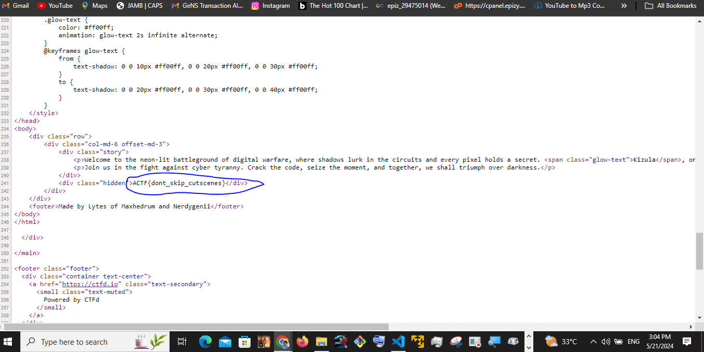

```
Flag: ACTF{dont_skip_cutscenes}
```

### Say Hello
 <!--   -->

Since I had been following most of the accounts already, I followed the new ones and then submitted. `Yes` :)

```
Flag: Yes
```

### Do you read 2
<!--  -->

Just submit that 

```
Flag: actf{i_did_not_skip_this_cutscene}
```


### Troll
<!--  -->

Navigating to the provided URL didn't display any content.


Viewing page source reveals nothing also
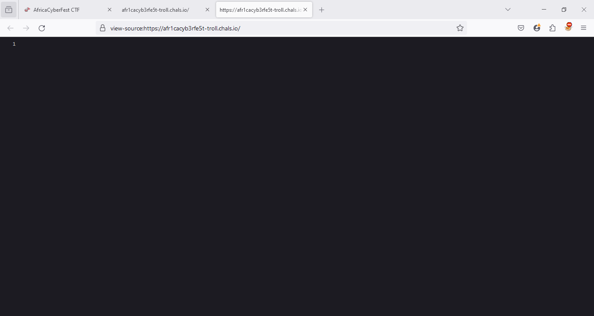


To ensure the security and thorough assessment of the target website, I utilized the "Discover Hidden Directories and Files" tool provided by Pentest-Tools.com. This tool is designed to uncover directories and pages that are not easily visible through standard navigation or indexing.


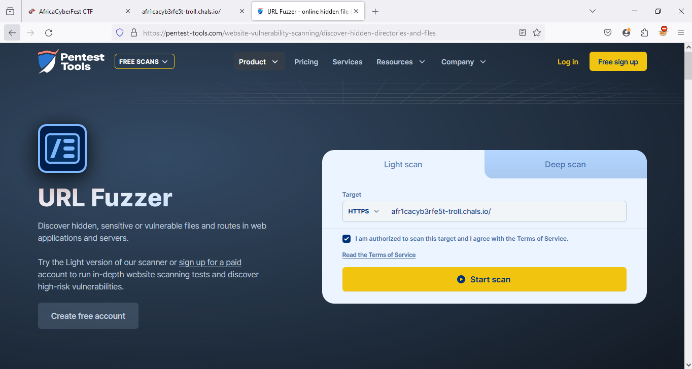

After searching for hidden directories, I found this site, 
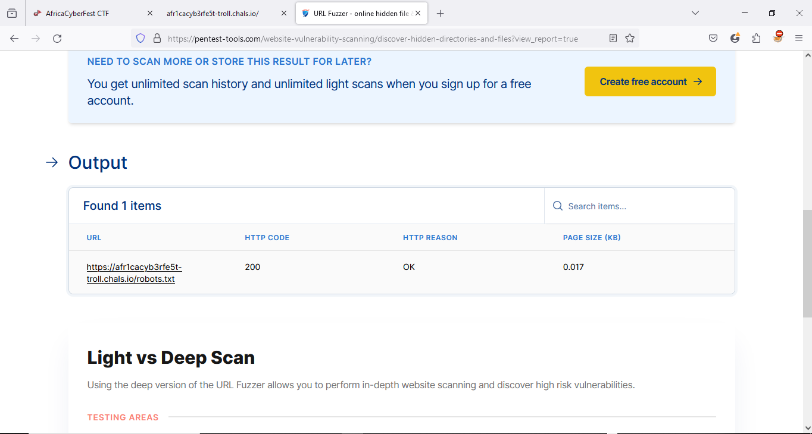

After navigating to the robots.txt page, I found that the content included the line "/flagflagflag.txt," indicating that a flag might be related to this file. Additionally, I downloaded the robots.txt file for further analysis.


I opened the robots.txt file with Notepad and found a word matching the pattern "actf
Boom! I found the flag. 
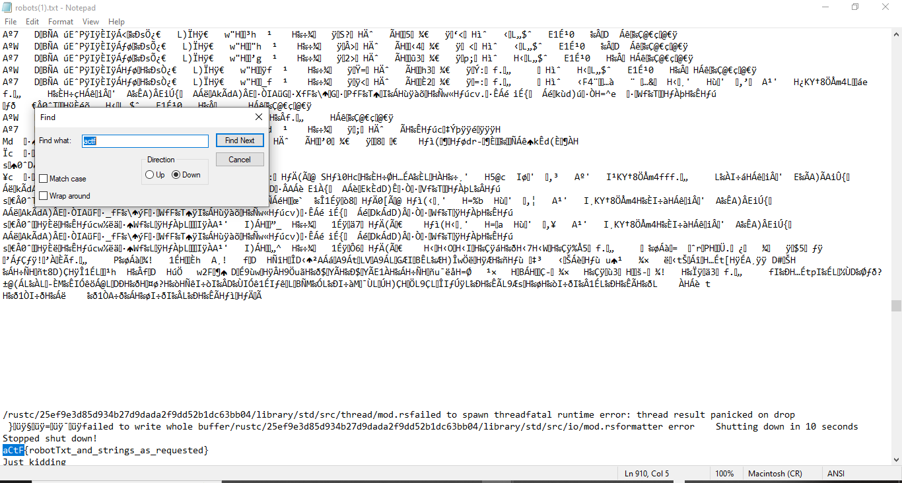

```
Flag: aCtF{robotTxt_and_strings_as_requested}
```


### Finding nulock 
<!--  -->

Basically, after identifying the file as an APK using the file command on my Kali Linux environment and confirming it was Zipped APK , 
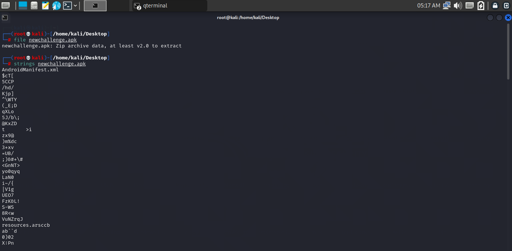

I moved it to my Windows environment
 I adjusted my settings to allow the file to be downloaded. Then, I used an online [decompiler](https://www.decompiler.com/) to analyze the APK Zip file.

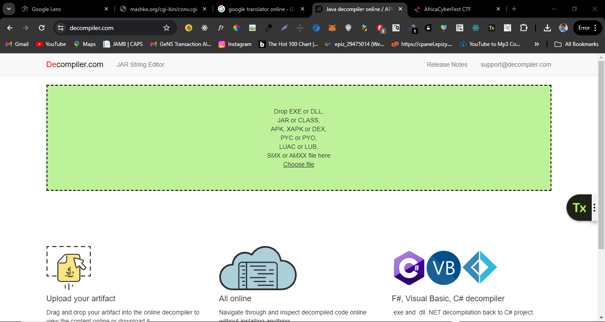

Upon decompiling, we could see resources and identified a Metasploit stager within the file
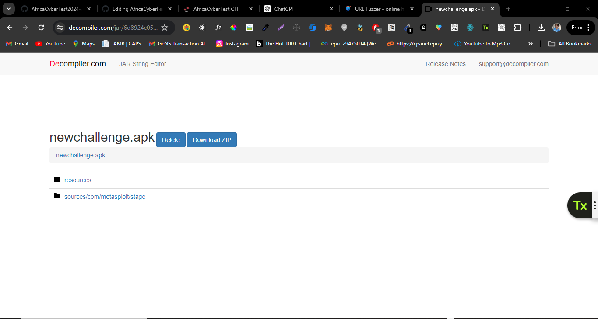

I went into the resource folder and downloaded the classes.dex file because I suspected it might contain crucial information or code. The classes.dex file is a compiled file in Android applications that contains executable code and resources. Since APK files are essentially Android application packages, it was reasonable to suspect that the classes.dex file might contain important functionality or even potential vulnerabilities, considering the suspicious nature of the APK file and its association with Metasploit.
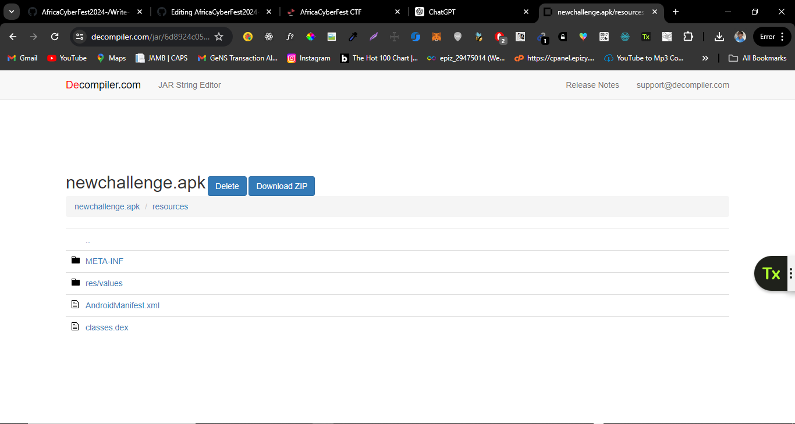

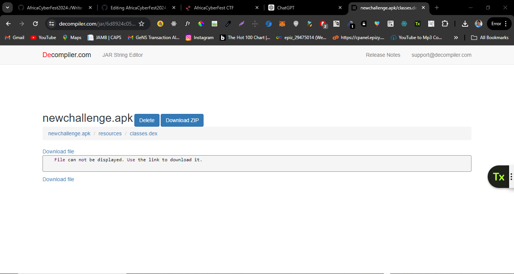


After downloading the classes.dex file, I used Visual Studio Code to view its contents. Given the suspicion surrounding the APK file and the presence of a Metasploit stager, I searched within the classes.dex file for the format "ACTF{". Boom! I found the flag.

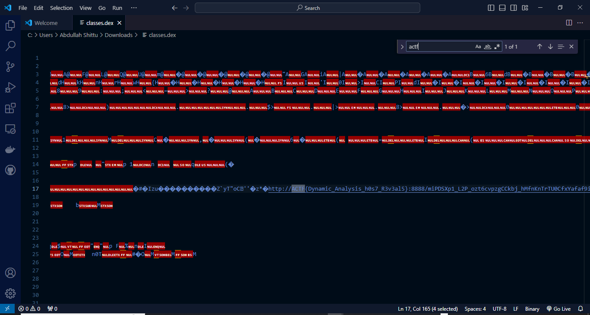

```
Flag: ACTF{Dynamic_Analysis_h0s7_R3v3al5}
```

### Hip Hip HIp!
<!--  -->

Just submit that :)

```
Flag: ACTF{Happy_Birthday!_Lytes}
```

At the end of the CTF prequalification, my team secured the 4th position. In the final, we maintained our 4th place. However, I felt disappointed as I managed to solve the trickier challenges only after the CTF concluded. Nonetheless, considering this was my first official CTF, I still see it as a significant achievement.
<!-- 
 -->

## Challenges Solved After CTF Finals:

After the CTF finals concluded, I managed to solve some of the trickier challenges.

## Misc
### fun???
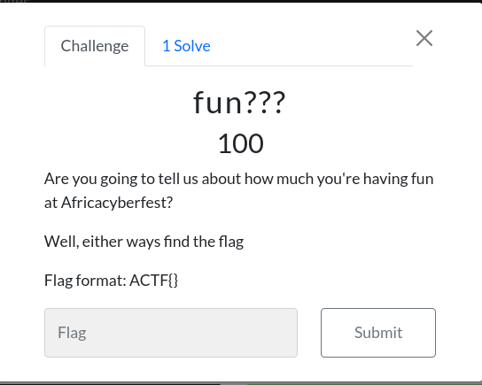

The discovery revolves around Unicode steganography, particularly with zero-width characters
When you inspect element you’ll see this
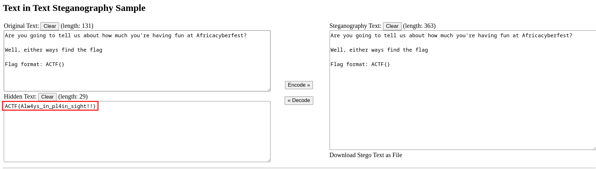


We got our flagüòé
```
Flag: ACTF{Alw4ys_in_pl4in_sight!!}
```
## Cryptography

### S1mple


I downloaded the simple.txt file and upon opening it, I noticed whitespace encoding beneath the binary content. Subsequently, I employed the stegsnow tool in my Kali Linux environment to proceed with analysis.
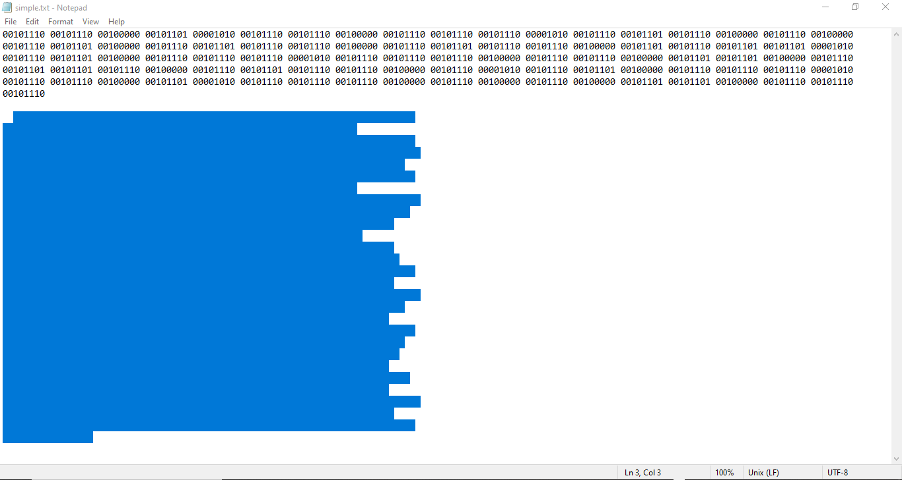


I cross-checked it on my Kali Linux environment, then used the file command on the simple.txt file to verify if it was indeed a text file. Afterward, I ran the strings command on the simple.txt file and obtained the same output.


Then I employed the stegsnow tool with the -C simple.txt command to scrutinize the image.


If stegsnow isn't installed, you can install it using the appropriate command for your system."
To install stegsnow on Kali Linux, you can use the following command in your terminal:


sudo apt-get install stegsnow


I then copied the cipher to the website mashke.org, which provides an automatic Cyrillic encoder. I tried several encodings, but when I used the Windows-1251 encoding, I successfully obtained the flag, which was translated from Russian to English.


I converted it Boom! I got the flag.
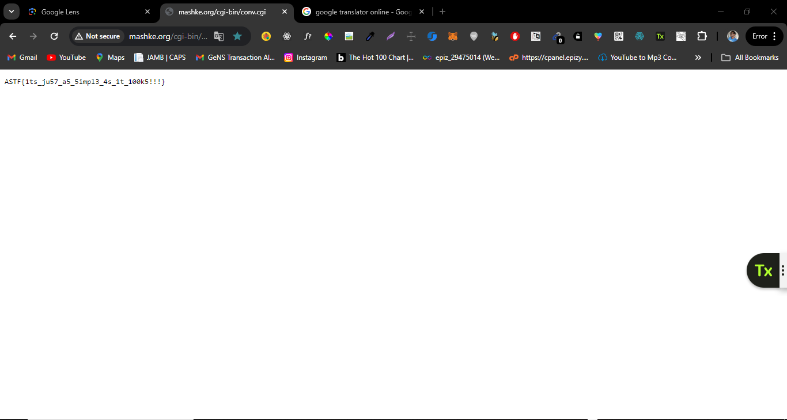
```
Flag: ACTF{1ts_ju57_a5_5impl3_4s_1t_100k5!!!}
```

## Steganography
### Plane Sight

The Plane Sight challenge was initially one challenge. However, when it became apparent that we couldn't solve it, they made it into two challenges.

The first thing I did was to use the `file` command to check the image and confirm that it was indeed a JPEG image. Then, I used the `strings` command to see any content, but the results were all clunky. But then I saw something related to `exiftool`.

Then what I did was to use the `exiftool` tool to check the image.
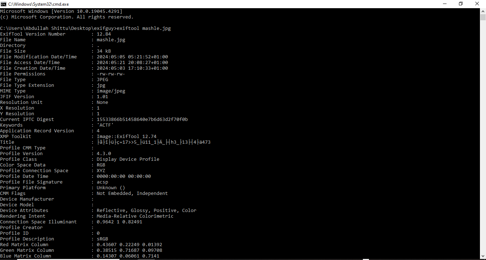


I got some encoded words/string in the title section.

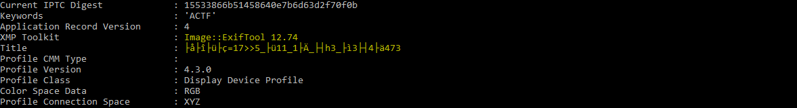


We also received some hints in the notifications that the encoded words are in Cyrillic, similar to the cryptography challenge.


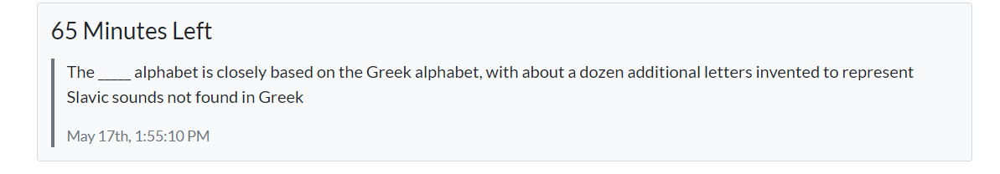


I also utilized https://www.aperisolve.com/ to inspect the image.


I found something similar in the title section using ExifTool. I then posted this on ChatGPT and received an HTML encoded string.


I then posted this on ChatGPT and received an HTML encoded string.


Then, I followed the same process as I did in the cryptography challenge. I posted the encoded string on the automatic Cyrillic decoder at mashke.org.
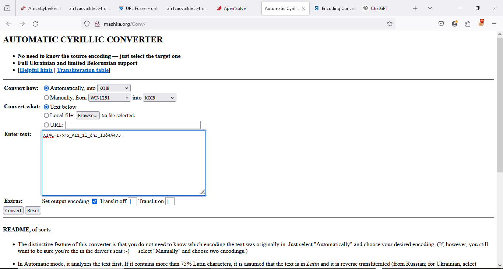

Then, when I converted the page, it automatically translated from Bulgarian/Russian to English.
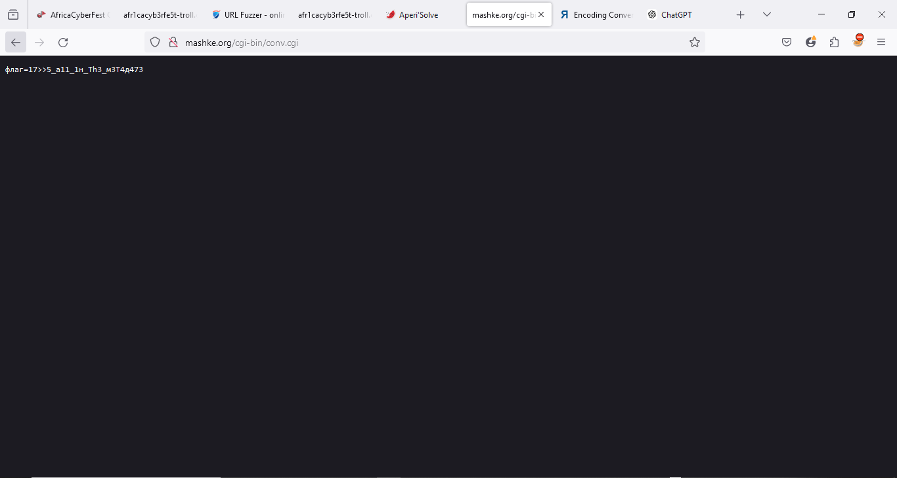

But I still had to be sure, so I used Google to detect it.


I confirmed that it was indeed Serbian. I translated it to English.
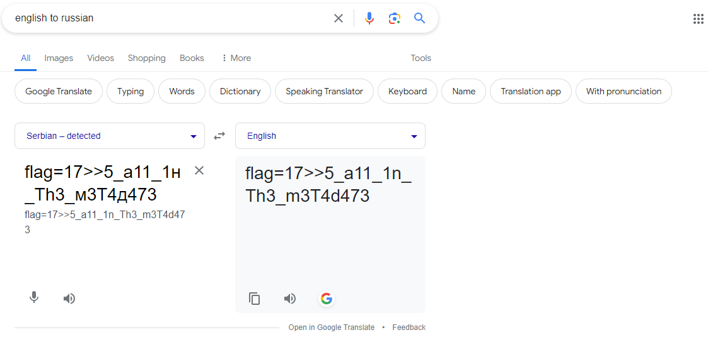

I tried using this as the flag, but it didn't work. I left it for a while, thinking a bitwise operation like "17>>5" might be involved. Later, I got a hint/idea to use other Cyrillic encoders. Then I used https://convertcyrillic.com/#/.


I did lots of trial and error here, but when I used KOI-8 to Phonetic (Modified Library of Congress Transliteration) [Russki\i ^iazyk], I got another string. I tried this string, and I was surprised to see it was the flag.

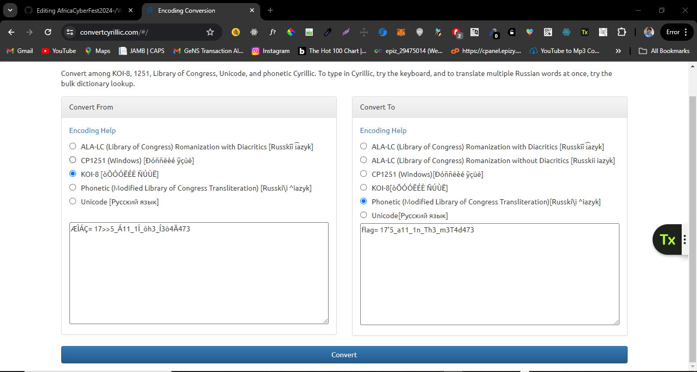

```
Flag: ACTF{17'5_a11_1n_Th3_m3T4d473}
```
## Plane Sight 2


The Luffy quotes are just there to confuse you. The flag is the same as the first one.

```
Flag: ACTF{17'5_a11_1n_Th3_m3T4d473}
```
That's all for now! I'm still working on finding more CTF challenges 🕵️‍♂️, but bye for now! 👋


#### References
I'd like to give a huge shoutout to the following resources that were invaluable to this Write-ups

- **Blackanon22's Blog**: The detailed posts on various CTF competitions, including the Africa Cyberfest, provided insightful strategies and solutions. You can check it out [here](https://blackanon22.github.io/posts/CTF%20Competitions/africa_cyberfest.html).

- **h4ckyou's GitHub Repository**: This repository contains a comprehensive write-up on Cyberfest24, offering a step-by-step guide on how the challenges were tackled. Visit the repository [here](https://github.com/h4ckyou/h4ckyou.github.io/blob/main/posts/ctf/cyberfest24/writeup.md) for more detailed information.

- **OTI's GitHub Repository**:This repository contains a collection of write-ups on various CTF challenges, providing step-by-step guides on how each challenge was approached and solved. Additionally, it includes an explanation of the "nc shell" challenge, highlighting the use of shell expansion techniques. Visit the repository [here](https://justfavour.github.io/)

These resources were instrumental in enhancing my understanding and approach to the challenges faced during the competition. Thank you to the creators for sharing their knowledge and expertise with the community!


